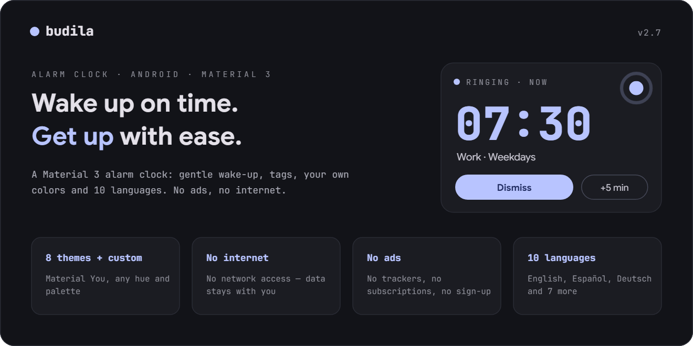
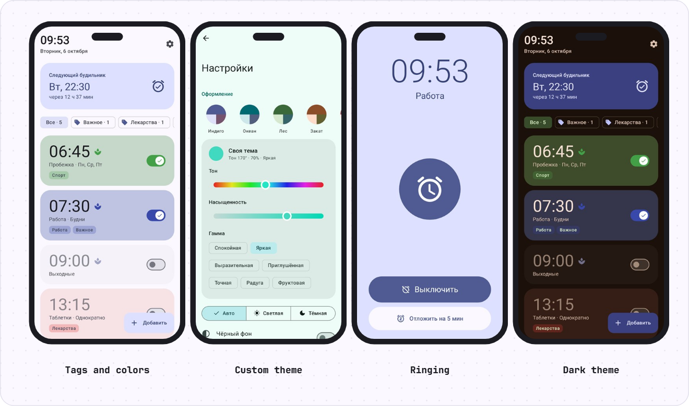
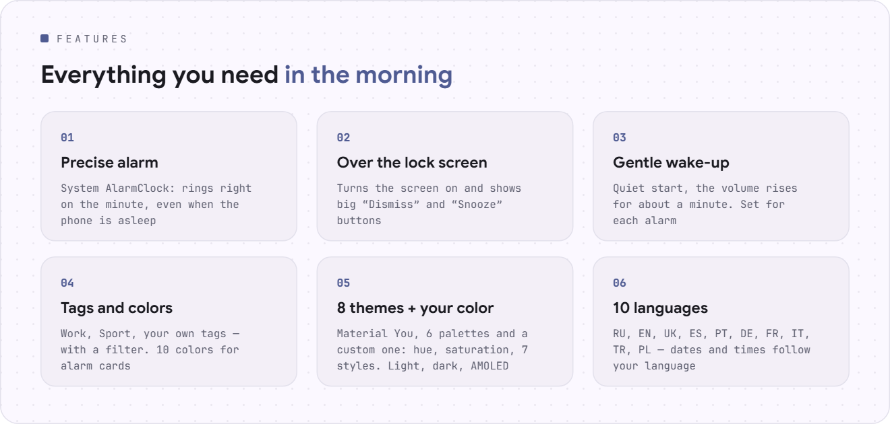
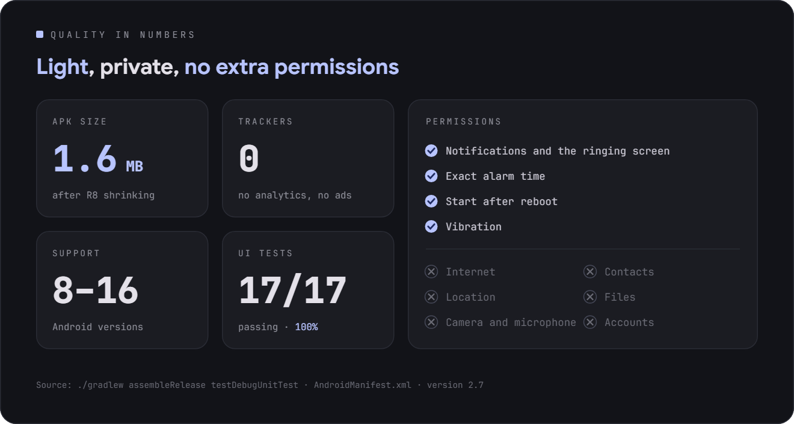

<div align="center">

[Русский](README.md) · **English** · [Español](README.es.md) · [Português](README.pt.md) · [Deutsch](README.de.md) · [Français](README.fr.md) · [Italiano](README.it.md) · [Türkçe](README.tr.md) · [Українська](README.uk.md) · [Polski](README.pl.md)

<br>

<picture><source srcset="assets/readme/hero-en.svg"></picture>

<a href="https://github.com/sailxx/Budila/releases/latest/download/Budila.apk"></a>

[](https://github.com/sailxx/Budila/actions/workflows/build.yml)

</div>

<br>

<picture><source srcset="assets/readme/screens-en.svg"></picture>

<br>

<picture><source srcset="assets/readme/features-en.svg"></picture>

<details>
<summary>More about the features</summary>

### ⏰ Main screen

The current time and date are shown big at the top — “Tuesday, October 6”. Below is the **“Next alarm”** card: the day, the time and how long is left. Alarms can be painted in any of 10 colors and marked with **tags** — a row of filters (“All · 5”, “Work · 2”) shows only the ones you need.

### ✏️ Editor

Set the time on the **Material 3 dial** or with the keyboard. Label, repeat on weekdays, tags (ready-made or your own), card color, vibration and **gentle wake-up**. A deleted alarm comes back with a single tap.

### 🌿 Gentle wake-up

The alarm starts almost silent, the volume rises smoothly for about a minute, and vibration kicks in after 30 seconds. The mode is turned on and off **for each alarm separately**; the settings decide what new alarms get.

### 🔔 Ringing

The ringing screen turns the display on by itself and opens **over the lock screen**. **“Dismiss”** and **“Snooze”** (for 5–20 minutes) are on the screen and in the notification. If nobody answers, the alarm goes quiet by itself after 5–30 minutes.

### 🧮 “Instrument” design

Budila’s own design in the style of [Okto](https://github.com/sailxx/Okto): a monochrome casing, real keys and recessed displays, like an engineering calculator. Digits are JetBrains Mono with “unlit” eights and a self-test at launch, the time is typed on a keypad, and a ringing alarm glows red. 9 themes — Classic (light, dark, OLED), Paper, Mint, Sakura, Midnight, Ocean, Nord, Crimson, Amber. It is on by default; Material 3 can be brought back in the settings.

### 🎨 Themes

8 themes: **Material You** from your wallpaper, Indigo, Ocean, Forest, Sunset, Sakura, Graphite and **Custom** — pick a hue on the color wheel, the saturation and the style (Calm, Vibrant, Expressive, Rainbow…). Light, dark or follow the system, plus a pure black background for AMOLED.

### 🌍 10 languages

Русский, English, Українська, Español, Português, Deutsch, Français, Italiano, Türkçe, Polski. On Android 13+ Budila’s language can be chosen separately from the system.

### 🛡 Reliability

Alarms are set through the system `AlarmClock` and ring on time even when the phone is asleep. After a reboot or a change of time or time zone, Budila sets them again.

</details>

<br>

<picture><source srcset="assets/readme/quality-en.svg"></picture>

<br>

<picture><source srcset="assets/readme/design-en.svg"></picture>

## Install

1. Download [**Budila.apk**](https://github.com/sailxx/Budila/releases/latest/download/Budila.apk) to your phone.
2. Open the file and allow installs from this source.
3. On first launch, allow notifications — without them the ringing screen won’t appear.

Requires Android 8.0 or newer. No Google Play and no accounts needed.

Budila is also in [Komi Store](https://github.com/komi-store/komi-store), an app store built on GitHub releases: search for “Budila”, and Komi Store will offer updates by itself.

<details>
<summary>Build from source</summary>

You need JDK 17+ and the Android SDK (platform 36).

```bash
git clone https://github.com/sailxx/Budila.git
cd Budila
./gradlew assembleRelease
```

Releases are built on GitHub automatically: bump `versionCode`/`versionName` in `app/build.gradle.kts` and push a tag (`git tag v2.5 && git push origin v2.5`) — Actions will build, sign and publish `Budila.apk`. For a local signed build, copy `keystore.properties.example` to `keystore.properties` and fill in your key; without it you get an unsigned APK. Screenshots (including English, German and Spanish ones) are redrawn by `./gradlew testDebugUnitTest` (Robolectric, no phone needed) and land in `screenshots/`. The README images in every language are built by `node tools/readme/build.mjs`; their texts live in `tools/readme/strings.json`.

**Stack:** Kotlin · Jetpack Compose · Material 3 · [MaterialKolor](https://github.com/jordond/MaterialKolor) · AlarmManager · Foreground Service.

</details>

## Privacy and security

Budila has **no internet access**: there is no `INTERNET` permission in the manifest. Alarms are stored only on the phone and are not included in cloud backups. No ads, no analytics, no trackers. Details and how to report a vulnerability are in [SECURITY.md](SECURITY.md).

<br>

<div align="center"><sub>© 2026 sailxx. All rights reserved.</sub></div>
