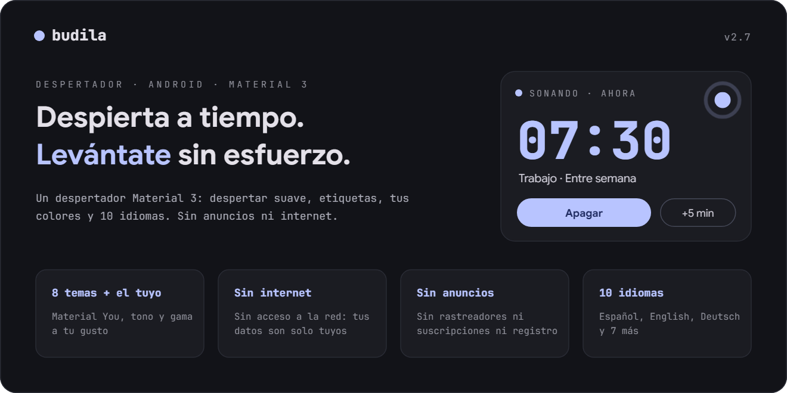
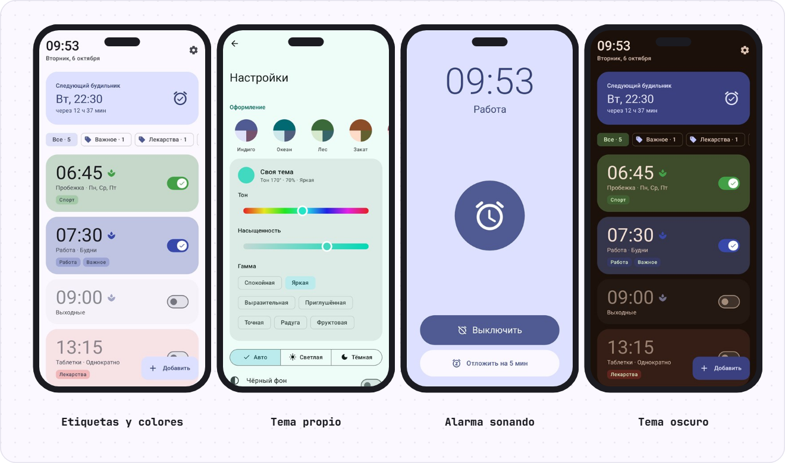
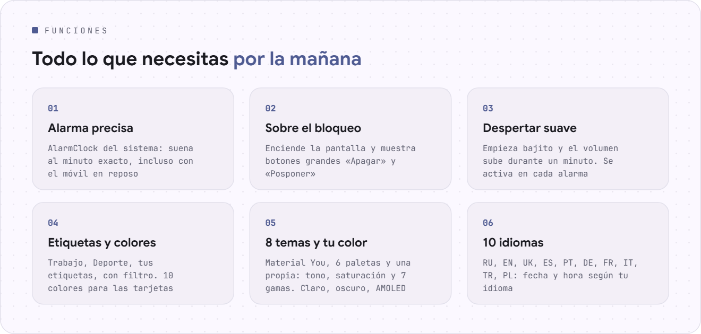
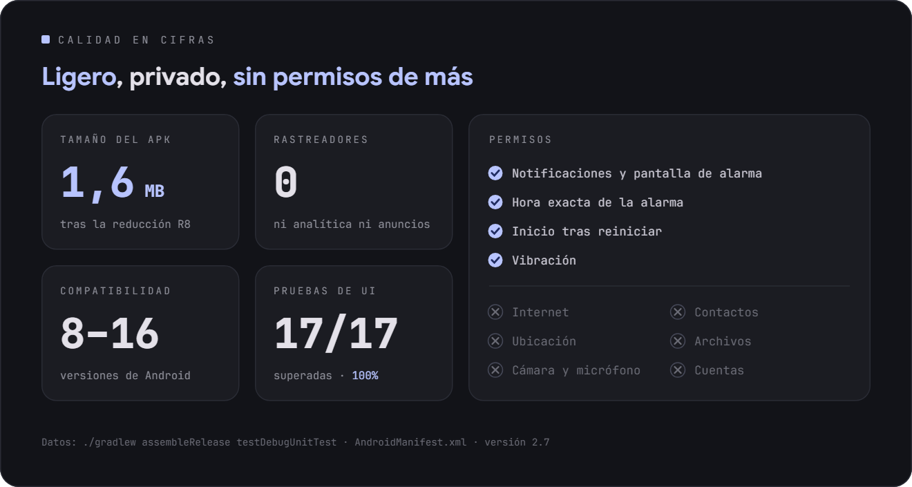
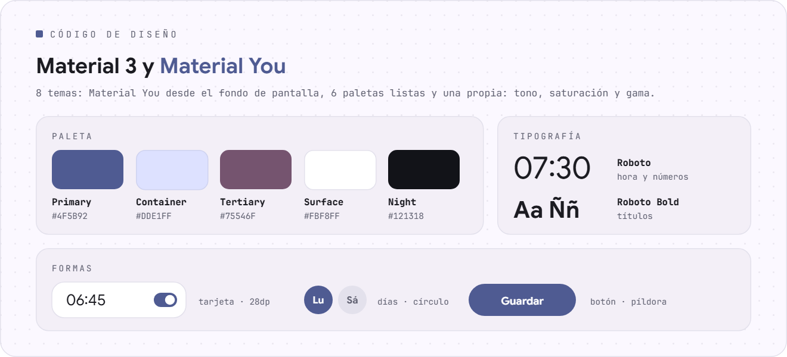

<div align="center">

[Русский](README.md) · [English](README.en.md) · **Español** · [Português](README.pt.md) · [Deutsch](README.de.md) · [Français](README.fr.md) · [Italiano](README.it.md) · [Türkçe](README.tr.md) · [Українська](README.uk.md) · [Polski](README.pl.md)

<br>

<picture><source srcset="assets/readme/hero-es.svg"></picture>

<a href="https://github.com/sailxx/Budila/releases/latest/download/Budila.apk"></a>

[](https://github.com/sailxx/Budila/actions/workflows/build.yml)

</div>

<br>

<picture><source srcset="assets/readme/screens-es.svg"></picture>

<br>

<picture><source srcset="assets/readme/features-es.svg"></picture>

<details>
<summary>Más sobre las funciones</summary>

### ⏰ Pantalla principal

Arriba, en grande, la hora y la fecha actuales: «martes, 6 de octubre». Debajo, la tarjeta **«Próxima alarma»**: el día, la hora y cuánto falta. Las alarmas se pueden pintar en cualquiera de 10 colores y marcar con **etiquetas**: una fila de filtros («Todas · 5», «Trabajo · 2») muestra solo las que necesitas.

### ✏️ Editor

La hora se pone en el **dial de Material 3** o con el teclado. Nombre, repetición por días de la semana, etiquetas (predefinidas o propias), color de la tarjeta, vibración y **despertar suave**. Una alarma borrada se recupera con un solo botón.

### 🌿 Despertar suave

La alarma empieza casi en silencio, el volumen sube poco a poco durante un minuto y la vibración se activa a los 30 segundos. El modo se activa y desactiva **en cada alarma por separado**; en los ajustes eliges cómo será en las nuevas.

### 🔔 Alarma sonando

La pantalla de alarma enciende el display por sí sola y se abre **sobre la pantalla de bloqueo**. **«Apagar»** y **«Posponer»** (de 5 a 20 minutos) están en la pantalla y en la notificación. Si nadie responde, la alarma se calla sola tras 5–30 minutos.

### 🧮 Diseño «Instrumento»

El diseño propio de Budila al estilo de [Okto](https://github.com/sailxx/Okto): carcasa monocroma, teclas de verdad y pantallas hundidas, como una calculadora científica. Las cifras son JetBrains Mono con ochos «apagados» y una autoprueba al iniciar, la hora se marca en un teclado y la alarma que suena brilla en rojo. 9 temas: Clásico (claro, oscuro, OLED), Papel, Menta, Sakura, Medianoche, Océano, Nord, Carmesí, Ámbar. Está activado por defecto; en los ajustes se puede volver a Material 3.

### 🎨 Temas

8 temas: **Material You** desde el fondo de pantalla, Índigo, Océano, Bosque, Atardecer, Sakura, Grafito y **Propio**: elige el tono en la rueda de color, la saturación y la gama (Tranquila, Vibrante, Expresiva, Arcoíris…). Claro, oscuro o según el sistema, además de un fondo negro puro para AMOLED.

### 🌍 10 idiomas

Русский, English, Українська, Español, Português, Deutsch, Français, Italiano, Türkçe, Polski. En Android 13+ el idioma de Budila se puede elegir aparte del del sistema.

### 🛡 Fiabilidad

Las alarmas se programan con el `AlarmClock` del sistema y suenan a su hora aunque el teléfono esté en reposo. Tras reiniciar o cambiar la hora o la zona horaria, Budila las vuelve a programar.

</details>

<br>

<picture><source srcset="assets/readme/quality-es.svg"></picture>

<br>

<picture><source srcset="assets/readme/design-es.svg"></picture>

## Instalación

1. Descarga [**Budila.apk**](https://github.com/sailxx/Budila/releases/latest/download/Budila.apk) en el teléfono.
2. Abre el archivo y permite la instalación desde este origen.
3. En el primer inicio, permite las notificaciones: sin ellas no aparecerá la pantalla de alarma.

Requiere Android 8.0 o superior. No hacen falta Google Play ni cuentas.

Budila también está en [Komi Store](https://github.com/komi-store/komi-store), una tienda de apps basada en las versiones de GitHub: busca «Budila» y Komi Store te ofrecerá las actualizaciones.

<details>
<summary>Compilar desde el código fuente</summary>

Necesitas JDK 17+ y el Android SDK (plataforma 36).

```bash
git clone https://github.com/sailxx/Budila.git
cd Budila
./gradlew assembleRelease
```

Las versiones se compilan en GitHub automáticamente: sube `versionCode`/`versionName` en `app/build.gradle.kts` y envía una etiqueta (`git tag v2.5 && git push origin v2.5`); Actions compilará, firmará y publicará `Budila.apk`. Para una compilación local firmada, copia `keystore.properties.example` a `keystore.properties` e indica tu clave; sin ella se genera un APK sin firmar. Las capturas (también en inglés, alemán y español) se regeneran con `./gradlew testDebugUnitTest` (Robolectric, sin teléfono) y aparecen en `screenshots/`. Las imágenes del README en todos los idiomas las genera `node tools/readme/build.mjs`; sus textos están en `tools/readme/strings.json`.

**Tecnologías:** Kotlin · Jetpack Compose · Material 3 · [MaterialKolor](https://github.com/jordond/MaterialKolor) · AlarmManager · Foreground Service.

</details>

## Privacidad y seguridad

Budila **no tiene acceso a internet**: el manifiesto no incluye el permiso `INTERNET`. Las alarmas se guardan solo en el teléfono y no entran en las copias de seguridad en la nube. Sin anuncios, analítica ni rastreadores. Los detalles y cómo informar de una vulnerabilidad están en [SECURITY.md](SECURITY.md).

<br>

<div align="center"><sub>© 2026 sailxx. Todos los derechos reservados.</sub></div>
