<div align="center">

[Русский](README.md) · [English](README.en.md) · [Español](README.es.md) · [Português](README.pt.md) · [Deutsch](README.de.md) · **Français** · [Italiano](README.it.md) · [Türkçe](README.tr.md) · [Українська](README.uk.md) · [Polski](README.pl.md)

<br>


<a href="https://github.com/sailxx/Budila/releases/latest/download/Budila.apk"></a>

[](https://github.com/sailxx/Budila/actions/workflows/build.yml)

</div>

<br>



<br>



<details>
<summary>En savoir plus sur les fonctionnalités</summary>

### ⏰ Écran principal

En haut, en grand, l’heure et la date du jour : « mardi 6 octobre ». En dessous, la carte **« Prochaine alarme »** : le jour, l’heure et le temps restant. Les alarmes peuvent prendre l’une des 10 couleurs et recevoir des **étiquettes** — une rangée de filtres (« Toutes · 5 », « Travail · 2 ») n’affiche que celles qui vous intéressent.

### ✏️ Éditeur

L’heure se règle sur le **cadran Material 3** ou au clavier. Nom, répétition selon les jours de la semaine, étiquettes (prêtes ou personnelles), couleur de la carte, vibration et **réveil en douceur**. Une alarme supprimée revient d’un seul geste.

### 🌿 Réveil en douceur

La sonnerie démarre presque sans bruit, le volume monte progressivement pendant environ une minute et la vibration s’active après 30 secondes. Le mode s’active et se désactive **pour chaque alarme séparément** ; les réglages définissent son état pour les nouvelles alarmes.

### 🔔 Sonnerie

L’écran de sonnerie allume l’affichage tout seul et s’ouvre **par-dessus l’écran de verrouillage**. **« Arrêter »** et **« Répéter »** (de 5 à 20 minutes) sont sur l’écran et dans la notification. Si personne ne répond, la sonnerie s’arrête d’elle-même au bout de 5 à 30 minutes.

### 🧮 Design « Instrument »

Le design propre à Budila, dans le style d’[Okto](https://github.com/sailxx/Okto) : boîtier monochrome, vraies touches et écrans en creux, comme une calculatrice d’ingénieur. Les chiffres sont en JetBrains Mono avec des huit « éteints » et un autotest au démarrage, l’heure se tape sur un clavier et une alarme qui sonne s’allume en rouge. 9 thèmes — Classique (clair, sombre, OLED), Papier, Menthe, Sakura, Minuit, Océan, Nord, Carmin, Ambre. Activé par défaut ; Material 3 peut être rétabli dans les réglages.

### 🎨 Thèmes

8 thèmes : **Material You** à partir du fond d’écran, Indigo, Océan, Forêt, Crépuscule, Sakura, Graphite et **Perso** — choisissez la teinte sur la roue chromatique, la saturation et la gamme (Calme, Vive, Expressive, Arc-en-ciel…). Clair, sombre ou selon le système, plus un fond noir pur pour l’AMOLED.

### 🌍 10 langues

Русский, English, Українська, Español, Português, Deutsch, Français, Italiano, Türkçe, Polski. Sur Android 13+, la langue de Budila peut être choisie indépendamment de celle du système.

### 🛡 Fiabilité

Les alarmes passent par l’`AlarmClock` du système et sonnent à l’heure même quand le téléphone est en veille. Après un redémarrage ou un changement d’heure ou de fuseau horaire, Budila les reprogramme.

</details>

<br>


<br>



## Installation

1. Téléchargez [**Budila.apk**](https://github.com/sailxx/Budila/releases/latest/download/Budila.apk) sur votre téléphone.
2. Ouvrez le fichier et autorisez l’installation depuis cette source.
3. Au premier lancement, autorisez les notifications — sans elles, l’écran de sonnerie n’apparaîtra pas.

Nécessite Android 8.0 ou plus récent. Ni Google Play ni compte nécessaires.

Budila est aussi disponible dans [Komi Store](https://github.com/komi-store/komi-store), une boutique d’applications basée sur les versions GitHub : cherchez « Budila », et Komi Store proposera les mises à jour tout seul.

<details>
<summary>Compiler depuis les sources</summary>

Il faut le JDK 17+ et l’Android SDK (plateforme 36).

```bash
git clone https://github.com/sailxx/Budila.git
cd Budila
./gradlew assembleRelease
```

Les versions sont compilées automatiquement sur GitHub : augmentez `versionCode`/`versionName` dans `app/build.gradle.kts` et poussez un tag (`git tag v2.5 && git push origin v2.5`) — Actions compile, signe et publie `Budila.apk`. Pour une compilation locale signée, copiez `keystore.properties.example` vers `keystore.properties` et indiquez votre clé ; sans elle, l’APK n’est pas signé. Les captures d’écran (y compris en anglais, allemand et espagnol) sont redessinées par `./gradlew testDebugUnitTest` (Robolectric, sans téléphone) et arrivent dans `screenshots/`. Les images du README dans toutes les langues sont générées par `node tools/readme/build.mjs` ; leurs textes sont dans `tools/readme/strings.json`.

**Technologies :** Kotlin · Jetpack Compose · Material 3 · [MaterialKolor](https://github.com/jordond/MaterialKolor) · AlarmManager · Foreground Service.

</details>

## Confidentialité et sécurité

Budila **n’a pas accès à internet** : le manifeste ne contient pas l’autorisation `INTERNET`. Les alarmes restent uniquement sur le téléphone et ne vont pas dans les sauvegardes cloud. Pas de publicité, pas d’analytique, pas de traqueurs. Les détails et la façon de signaler une vulnérabilité sont dans [SECURITY.md](SECURITY.md).

<br>

<div align="center"><sub>© 2026 sailxx. Tous droits réservés.</sub></div>
