<div align="center">

[Русский](README.md) · [English](README.en.md) · [Español](README.es.md) · [Português](README.pt.md) · [Deutsch](README.de.md) · [Français](README.fr.md) · **Italiano** · [Türkçe](README.tr.md) · [Українська](README.uk.md) · [Polski](README.pl.md)

<br>


<a href="https://github.com/sailxx/Budila/releases/latest/download/Budila.apk"></a>

[](https://github.com/sailxx/Budila/actions/workflows/build.yml)

</div>

<br>



<br>


<details>
<summary>Di più sulle funzioni</summary>

### ⏰ Schermata principale

In alto, in grande, l’ora e la data di oggi: «martedì 6 ottobre». Sotto c’è la scheda **«Prossima sveglia»**: il giorno, l’ora e quanto manca. Le sveglie si possono colorare con uno dei 10 colori e contrassegnare con dei **tag**: una fila di filtri («Tutte · 5», «Lavoro · 2») mostra solo quelle che servono.

### ✏️ Editor

L’ora si imposta sul **quadrante Material 3** o con la tastiera. Nome, ripetizione nei giorni della settimana, tag (già pronti o tuoi), colore della scheda, vibrazione e **risveglio dolce**. Una sveglia eliminata si recupera con un solo tocco.

### 🌿 Risveglio dolce

La sveglia parte quasi in silenzio, il volume sale gradualmente per circa un minuto e la vibrazione si attiva dopo 30 secondi. La modalità si attiva e disattiva **per ogni sveglia separatamente**; nelle impostazioni scegli come sarà per le nuove.

### 🔔 Sveglia che suona

La schermata della sveglia accende il display da sola e si apre **sopra la schermata di blocco**. **«Spegni»** e **«Posticipa»** (da 5 a 20 minuti) sono sullo schermo e nella notifica. Se nessuno risponde, la sveglia si zittisce da sola dopo 5–30 minuti.

### 🧮 Design «Strumento»

Il design di Budila nello stile di [Okto](https://github.com/sailxx/Okto): scocca monocromatica, tasti veri e display incassati, come una calcolatrice scientifica. Le cifre sono in JetBrains Mono con gli otto «spenti» e un autotest all’avvio, l’ora si digita su un tastierino e la sveglia che suona si illumina di rosso. 9 temi: Classico (chiaro, scuro, OLED), Carta, Menta, Sakura, Mezzanotte, Oceano, Nord, Cremisi, Ambra. È attivo di default; nelle impostazioni si può tornare a Material 3.

### 🎨 Temi

8 temi: **Material You** dallo sfondo, Indaco, Oceano, Foresta, Tramonto, Sakura, Grafite e **Personale**: scegli la tonalità sulla ruota dei colori, la saturazione e la gamma (Calma, Vivace, Espressiva, Arcobaleno…). Chiaro, scuro o come il sistema, più uno sfondo nero puro per AMOLED.

### 🌍 10 lingue

Русский, English, Українська, Español, Português, Deutsch, Français, Italiano, Türkçe, Polski. Su Android 13+ la lingua di Budila si può scegliere separatamente da quella di sistema.

### 🛡 Affidabilità

Le sveglie passano per l’`AlarmClock` di sistema e suonano puntuali anche quando il telefono è in standby. Dopo un riavvio o un cambio di ora o di fuso orario, Budila le reimposta.

</details>

<br>


<br>



## Installazione

1. Scarica [**Budila.apk**](https://github.com/sailxx/Budila/releases/latest/download/Budila.apk) sul telefono.
2. Apri il file e consenti l’installazione da questa origine.
3. Al primo avvio consenti le notifiche: senza di esse la schermata della sveglia non compare.

Serve Android 8.0 o successivo. Non servono Google Play né account.

Budila è anche su [Komi Store](https://github.com/komi-store/komi-store), uno store di app basato sulle release di GitHub: cerca «Budila» e Komi Store ti proporrà gli aggiornamenti da solo.

<details>
<summary>Compilare dai sorgenti</summary>

Servono JDK 17+ e Android SDK (piattaforma 36).

```bash
git clone https://github.com/sailxx/Budila.git
cd Budila
./gradlew assembleRelease
```

Le release vengono compilate su GitHub in automatico: aumenta `versionCode`/`versionName` in `app/build.gradle.kts` e invia un tag (`git tag v2.5 && git push origin v2.5`): Actions compila, firma e pubblica `Budila.apk`. Per una build locale firmata copia `keystore.properties.example` in `keystore.properties` e indica la tua chiave; senza, si ottiene un APK non firmato. Gli screenshot (anche in inglese, tedesco e spagnolo) si ridisegnano con `./gradlew testDebugUnitTest` (Robolectric, senza telefono) e finiscono in `screenshots/`. Le immagini del README in tutte le lingue le genera `node tools/readme/build.mjs`; i loro testi sono in `tools/readme/strings.json`.

**Stack:** Kotlin · Jetpack Compose · Material 3 · [MaterialKolor](https://github.com/jordond/MaterialKolor) · AlarmManager · Foreground Service.

</details>

## Privacy e sicurezza

Budila **non ha accesso a internet**: nel manifest non c’è il permesso `INTERNET`. Le sveglie restano solo sul telefono e non finiscono nei backup sul cloud. Niente pubblicità, analisi o tracker. Dettagli e come segnalare una vulnerabilità sono in [SECURITY.md](SECURITY.md).

<br>

<div align="center"><sub>© 2026 sailxx. Tutti i diritti riservati.</sub></div>
