<div align="center">

[Русский](README.md) · [English](README.en.md) · [Español](README.es.md) · [Português](README.pt.md) · [Deutsch](README.de.md) · [Français](README.fr.md) · [Italiano](README.it.md) · [Türkçe](README.tr.md) · [Українська](README.uk.md) · **Polski**

<br>


<a href="https://github.com/sailxx/Budila/releases/latest/download/Budila.apk"></a>

[](https://github.com/sailxx/Budila/actions/workflows/build.yml)

</div>

<br>



<br>



<details>
<summary><b>Więcej o funkcjach</b></summary>

### ⏰ Ekran główny

Na górze dużą czcionką bieżąca godzina i data — „wtorek, 6 października”. Niżej karta **„Następny alarm”**: dzień, godzina i ile zostało. Budziki można pokolorować na jeden z 10 kolorów i oznaczyć **tagami** — rząd filtrów („Wszystkie · 5”, „Praca · 2”) pokazuje tylko te potrzebne.

### ✏️ Edytor

Godzinę ustawisz na **tarczy Material 3** lub z klawiatury. Nazwa, powtarzanie w wybrane dni tygodnia, tagi (gotowe lub własne), kolor karty, wibracje i **łagodne budzenie**. Usunięty budzik wraca jednym dotknięciem.

### 🌿 Łagodne budzenie

Budzik zaczyna niemal bezgłośnie, głośność płynnie rośnie przez około minutę, a wibracje włączają się po 30 sekundach. Tryb włącza się i wyłącza **dla każdego budzika osobno**; w ustawieniach wybierasz, jaki będzie w nowych.

### 🔔 Dzwonienie

Ekran budzika sam włącza wyświetlacz i otwiera się **na ekranie blokady**. **„Wyłącz”** i **„Drzemka”** (na 5–20 minut) są na ekranie i w powiadomieniu. Jeśli nikt nie zareaguje, budzik sam ucichnie po 5–30 minutach.

### 🧮 Wygląd „Instrument”

Własny wygląd Budili w stylu [Okto](https://github.com/sailxx/Okto): monochromatyczna obudowa, prawdziwe klawisze i wpuszczone wyświetlacze jak w kalkulatorze inżynierskim. Cyfry to JetBrains Mono z „niezapalonymi” ósemkami i autotestem przy starcie, godzinę wpisuje się na klawiaturze, a dzwoniący budzik świeci na czerwono. 9 motywów — Klasyczny (jasny, ciemny, OLED), Papier, Mięta, Sakura, Północ, Ocean, Nord, Karmazyn, Bursztyn. Włączony domyślnie; w ustawieniach można wrócić do Material 3.

### 🎨 Motywy

8 motywów: **Material You** z tapety, Indygo, Ocean, Las, Zachód, Sakura, Grafit i **Własny** — wybierz odcień na kole barw, nasycenie i gamę (Spokojna, Żywa, Wyrazista, Tęcza…). Jasny, ciemny lub jak w systemie, a do tego czysto czarne tło dla AMOLED.

### 🌍 10 języków

Русский, English, Українська, Español, Português, Deutsch, Français, Italiano, Türkçe, Polski. Na Androidzie 13+ język Budili można wybrać niezależnie od systemu.

### 🛡 Niezawodność

Budziki są ustawiane przez systemowy `AlarmClock` i dzwonią punktualnie, nawet gdy telefon śpi. Po ponownym uruchomieniu albo zmianie godziny lub strefy czasowej Budila ustawia je od nowa.

</details>

<br>


<br>



## Instalacja

1. Pobierz [**Budila.apk**](https://github.com/sailxx/Budila/releases/latest/download/Budila.apk) na telefon.
2. Otwórz plik i zezwól na instalację z tego źródła.
3. Przy pierwszym uruchomieniu zezwól na powiadomienia — bez nich nie pojawi się ekran budzika.

Wymaga Androida 8.0 lub nowszego. Nie potrzeba Google Play ani kont.

Budila jest też w [Komi Store](https://github.com/komi-store/komi-store) — sklepie z aplikacjami opartym na wydaniach z GitHuba: wyszukaj „Budila”, a Komi Store sam zaproponuje aktualizacje.

<details>
<summary><b>Budowanie ze źródeł</b></summary>

Potrzebujesz JDK 17+ i Android SDK (platforma 36).

```bash
git clone https://github.com/sailxx/Budila.git
cd Budila
./gradlew assembleRelease
```

Wydania są budowane na GitHubie automatycznie: podnieś `versionCode`/`versionName` w `app/build.gradle.kts` i wypchnij tag (`git tag v2.5 && git push origin v2.5`) — Actions zbuduje, podpisze i opublikuje `Budila.apk`. Do lokalnej podpisanej kompilacji skopiuj `keystore.properties.example` do `keystore.properties` i wpisz swój klucz; bez niego powstanie niepodpisany APK. Zrzuty ekranu (także po angielsku, niemiecku i hiszpańsku) odświeża `./gradlew testDebugUnitTest` (Robolectric, bez telefonu), trafiają do `screenshots/`. Obrazki README we wszystkich językach generuje `node tools/readme/build.mjs`, ich teksty są w `tools/readme/strings.json`.

**Technologie:** Kotlin · Jetpack Compose · Material 3 · [MaterialKolor](https://github.com/jordond/MaterialKolor) · AlarmManager · Foreground Service.

</details>

## Prywatność i bezpieczeństwo

Budila **nie ma dostępu do internetu**: w manifeście nie ma uprawnienia `INTERNET`. Budziki są przechowywane tylko na telefonie i nie trafiają do kopii zapasowych w chmurze. Bez reklam, analityki i trackerów. Szczegóły i sposób zgłoszenia podatności są w [SECURITY.md](SECURITY.md).

<br>

<div align="center"><sub>© 2026 sailxx. Wszelkie prawa zastrzeżone.</sub></div>
