<div align="center">

[Русский](README.md) · [English](README.en.md) · [Español](README.es.md) · **Português** · [Deutsch](README.de.md) · [Français](README.fr.md) · [Italiano](README.it.md) · [Türkçe](README.tr.md) · [Українська](README.uk.md) · [Polski](README.pl.md)

<br>


<a href="https://github.com/sailxx/Budila/releases/latest/download/Budila.apk"></a>

[](https://github.com/sailxx/Budila/actions/workflows/build.yml)

</div>

<br>


<br>



<details>
<summary><b>Mais sobre os recursos</b></summary>

### ⏰ Tela principal

No topo, em letras grandes, a hora e a data atuais: “terça-feira, 6 de outubro”. Abaixo, o cartão **“Próximo alarme”**: o dia, a hora e quanto tempo falta. Os alarmes podem ganhar qualquer uma de 10 cores e receber **etiquetas** — uma fileira de filtros (“Todos · 5”, “Trabalho · 2”) mostra só os que você precisa.

### ✏️ Editor

A hora é definida no **mostrador do Material 3** ou pelo teclado. Nome, repetição por dias da semana, etiquetas (prontas ou suas), cor do cartão, vibração e **despertar suave**. Um alarme apagado volta com um único toque.

### 🌿 Despertar suave

O alarme começa quase sem som, o volume sobe aos poucos por cerca de um minuto e a vibração entra após 30 segundos. O modo é ligado e desligado **em cada alarme separadamente**; nas configurações você define como ele vem nos novos.

### 🔔 Alarme tocando

A tela do alarme liga o visor sozinha e abre **sobre a tela de bloqueio**. **“Desligar”** e **“Adiar”** (de 5 a 20 minutos) ficam na tela e na notificação. Se ninguém responder, o alarme silencia sozinho após 5–30 minutos.

### 🧮 Design “Instrumento”

O design próprio do Budila no estilo do [Okto](https://github.com/sailxx/Okto): corpo monocromático, teclas de verdade e visores rebaixados, como uma calculadora científica. Os dígitos são JetBrains Mono com oitos “apagados” e um autoteste ao abrir, a hora é digitada num teclado e o alarme tocando acende em vermelho. 9 temas — Clássico (claro, escuro, OLED), Papel, Menta, Sakura, Meia-noite, Oceano, Nord, Carmim, Âmbar. Vem ativado por padrão; nas configurações dá para voltar ao Material 3.

### 🎨 Temas

8 temas: **Material You** a partir do papel de parede, Índigo, Oceano, Floresta, Pôr do sol, Sakura, Grafite e **Próprio** — escolha o tom na roda de cores, a saturação e a gama (Calma, Vibrante, Expressiva, Arco-íris…). Claro, escuro ou igual ao sistema, além de fundo preto puro para AMOLED.

### 🌍 10 idiomas

Русский, English, Українська, Español, Português, Deutsch, Français, Italiano, Türkçe, Polski. No Android 13+ o idioma do Budila pode ser escolhido separado do sistema.

### 🛡 Confiabilidade

Os alarmes são agendados pelo `AlarmClock` do sistema e tocam na hora certa mesmo com o celular em repouso. Depois de reiniciar ou mudar a hora ou o fuso horário, o Budila os agenda de novo.

</details>

<br>


<br>


## Instalação

1. Baixe o [**Budila.apk**](https://github.com/sailxx/Budila/releases/latest/download/Budila.apk) no celular.
2. Abra o arquivo e permita a instalação desta fonte.
3. Na primeira abertura, permita as notificações — sem elas a tela de alarme não aparece.

Requer Android 8.0 ou mais recente. Não precisa de Google Play nem de contas.

O Budila também está na [Komi Store](https://github.com/komi-store/komi-store), uma loja de apps baseada nas versões do GitHub: procure “Budila” e a Komi Store vai oferecer as atualizações sozinha.

<details>
<summary><b>Compilar a partir do código-fonte</b></summary>

Você precisa do JDK 17+ e do Android SDK (plataforma 36).

```bash
git clone https://github.com/sailxx/Budila.git
cd Budila
./gradlew assembleRelease
```

As versões são compiladas no GitHub automaticamente: aumente `versionCode`/`versionName` em `app/build.gradle.kts` e envie uma tag (`git tag v1.6 && git push origin v1.6`) — o Actions compila, assina e publica o `Budila.apk`. Para uma compilação local assinada, copie `keystore.properties.example` para `keystore.properties` e informe sua chave; sem ela sai um APK não assinado. As capturas de tela (inclusive em inglês, alemão e espanhol) são refeitas por `./gradlew testDebugUnitTest` (Robolectric, sem celular) e aparecem em `screenshots/`. As imagens do README em todos os idiomas são geradas por `node tools/readme/build.mjs`; os textos delas ficam em `tools/readme/strings.json`.

**Tecnologias:** Kotlin · Jetpack Compose · Material 3 · [MaterialKolor](https://github.com/jordond/MaterialKolor) · AlarmManager · Foreground Service.

</details>

## Privacidade e segurança

O Budila **não tem acesso à internet**: o manifesto não tem a permissão `INTERNET`. Os alarmes ficam só no celular e não entram nos backups na nuvem. Sem anúncios, análises nem rastreadores. Detalhes e como relatar uma vulnerabilidade estão em [SECURITY.md](SECURITY.md).

<br>

<div align="center"><sub>© 2026 sailxx. Todos os direitos reservados.</sub></div>
