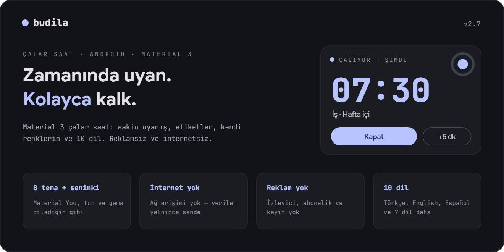
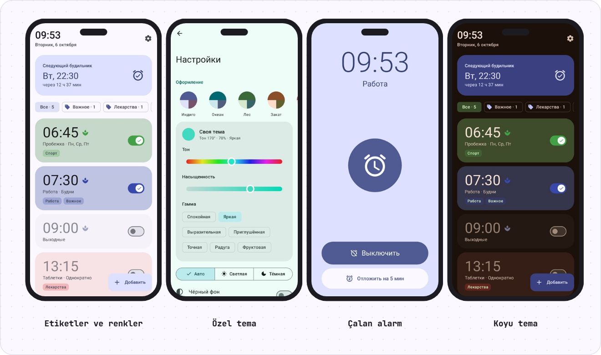
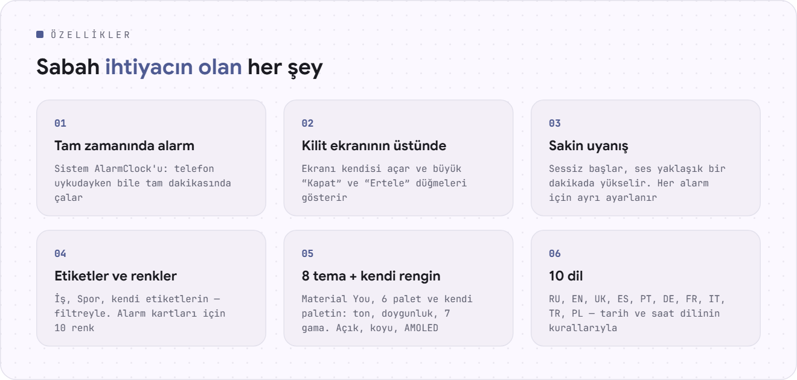
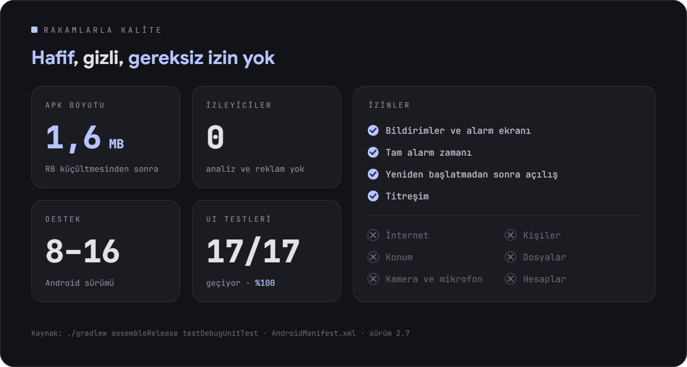
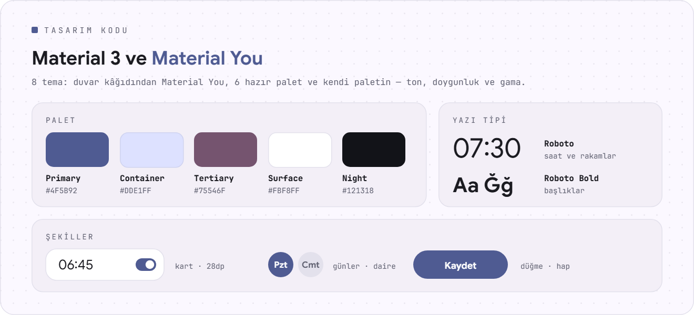

<div align="center">

[Русский](README.md) · [English](README.en.md) · [Español](README.es.md) · [Português](README.pt.md) · [Deutsch](README.de.md) · [Français](README.fr.md) · [Italiano](README.it.md) · **Türkçe** · [Українська](README.uk.md) · [Polski](README.pl.md)

<br>

<picture><source srcset="assets/readme/hero-tr.svg"></picture>

<a href="https://github.com/sailxx/Budila/releases/latest/download/Budila.apk"></a>

[](https://github.com/sailxx/Budila/actions/workflows/build.yml)

</div>

<br>

<picture><source srcset="assets/readme/screens-tr.svg"></picture>

<br>

<picture><source srcset="assets/readme/features-tr.svg"></picture>

<details>
<summary>Özellikler hakkında daha fazlası</summary>

### ⏰ Ana ekran

Üstte büyük harflerle güncel saat ve tarih: “6 Ekim Salı”. Altında **“Sonraki alarm”** kartı: gün, saat ve kalan süre. Alarmlar 10 renkten biriyle boyanabilir ve **etiketlerle** işaretlenebilir — filtre satırı (“Tümü · 5”, “İş · 2”) yalnızca istediklerinizi gösterir.

### ✏️ Düzenleyici

Saat **Material 3 kadranında** ya da klavyeyle ayarlanır. Ad, haftanın günlerine göre tekrar, etiketler (hazır ya da kendi etiketleriniz), kart rengi, titreşim ve **sakin uyanış**. Silinen bir alarm tek dokunuşla geri gelir.

### 🌿 Sakin uyanış

Alarm neredeyse sessiz başlar, ses yaklaşık bir dakika boyunca yavaşça yükselir, titreşim 30 saniye sonra devreye girer. Mod **her alarm için ayrı ayrı** açılıp kapanır; yeni alarmlarda nasıl olacağını ayarlardan seçersiniz.

### 🔔 Çalan alarm

Alarm ekranı ekranı kendisi açar ve **kilit ekranının üstünde** belirir. **“Kapat”** ve **“Ertele”** (5–20 dakika) hem ekranda hem bildirimde bulunur. Kimse yanıt vermezse alarm 5–30 dakika sonra kendiliğinden susar.

### 🧮 “Enstrüman” tasarımı

Budila'nın [Okto](https://github.com/sailxx/Okto) tarzındaki kendi tasarımı: tek renkli gövde, gerçek tuşlar ve gömme ekranlar; tıpkı bir mühendislik hesap makinesi gibi. Rakamlar “yanmayan” sekizli ve açılışta kendi kendini test eden JetBrains Mono ile yazılır, saat bir tuş takımında girilir ve çalan alarm kırmızı yanar. 9 tema — Klasik (açık, koyu, OLED), Kâğıt, Nane, Sakura, Gece yarısı, Okyanus, Nord, Kızıl, Kehribar. Varsayılan olarak açıktır; ayarlardan Material 3'e dönülebilir.

### 🎨 Temalar

8 tema: duvar kâğıdından **Material You**, Çivit, Okyanus, Orman, Gün batımı, Sakura, Grafit ve **Özel** — renk çemberinden tonu, doygunluğu ve gamı seçin (Sakin, Canlı, Etkileyici, Gökkuşağı…). Açık, koyu ya da sisteme göre; ayrıca AMOLED için saf siyah arka plan.

### 🌍 10 dil

Русский, English, Українська, Español, Português, Deutsch, Français, Italiano, Türkçe, Polski. Android 13 ve üzerinde Budila'nın dili sistemden ayrı seçilebilir.

### 🛡 Güvenilirlik

Alarmlar sistemin `AlarmClock` hizmetiyle kurulur ve telefon uykudayken bile zamanında çalar. Yeniden başlatmadan, saat ya da saat dilimi değişikliğinden sonra Budila onları yeniden kurar.

</details>

<br>

<picture><source srcset="assets/readme/quality-tr.svg"></picture>

<br>

<picture><source srcset="assets/readme/design-tr.svg"></picture>

## Kurulum

1. [**Budila.apk**](https://github.com/sailxx/Budila/releases/latest/download/Budila.apk) dosyasını telefonunuza indirin.
2. Dosyayı açın ve bu kaynaktan yüklemeye izin verin.
3. İlk açılışta bildirimlere izin verin — bunlar olmadan alarm ekranı görünmez.

Android 8.0 veya daha yenisi gerekir. Google Play ya da hesap gerekmez.

Budila, GitHub sürümlerine dayanan bir uygulama mağazası olan [Komi Store](https://github.com/komi-store/komi-store)'da da var: “Budila” diye arayın, güncellemeleri Komi Store kendisi önerir.

<details>
<summary>Kaynak koddan derleme</summary>

JDK 17+ ve Android SDK (platform 36) gerekir.

```bash
git clone https://github.com/sailxx/Budila.git
cd Budila
./gradlew assembleRelease
```

Sürümler GitHub'da otomatik derlenir: `app/build.gradle.kts` içinde `versionCode`/`versionName` değerini artırın ve bir etiket gönderin (`git tag v2.5 && git push origin v2.5`) — Actions `Budila.apk` dosyasını derler, imzalar ve yayınlar. Yerel imzalı derleme için `keystore.properties.example` dosyasını `keystore.properties` olarak kopyalayıp anahtarınızı yazın; o olmadan imzasız bir APK çıkar. Ekran görüntüleri (İngilizce, Almanca ve İspanyolca olanlar dahil) `./gradlew testDebugUnitTest` ile yeniden çizilir (Robolectric, telefon gerekmez) ve `screenshots/` klasörüne düşer. Tüm dillerdeki README görsellerini `node tools/readme/build.mjs` oluşturur; metinleri `tools/readme/strings.json` dosyasındadır.

**Teknolojiler:** Kotlin · Jetpack Compose · Material 3 · [MaterialKolor](https://github.com/jordond/MaterialKolor) · AlarmManager · Foreground Service.

</details>

## Gizlilik ve güvenlik

Budila'nın **internet erişimi yoktur**: manifestte `INTERNET` izni bulunmaz. Alarmlar yalnızca telefonda saklanır ve bulut yedeklerine girmez. Reklam, analiz ve izleyici yok. Ayrıntılar ve bir güvenlik açığını nasıl bildireceğiniz [SECURITY.md](SECURITY.md) dosyasında.

<br>

<div align="center"><sub>© 2026 sailxx. Tüm hakları saklıdır.</sub></div>
