<div align="center">

[Русский](README.md) · [English](README.en.md) · [Español](README.es.md) · [Português](README.pt.md) · [Deutsch](README.de.md) · [Français](README.fr.md) · [Italiano](README.it.md) · [Türkçe](README.tr.md) · **Українська** · [Polski](README.pl.md)

<br>


<a href="https://github.com/sailxx/Budila/releases/latest/download/Budila.apk"></a>

[](https://github.com/sailxx/Budila/actions/workflows/build.yml)

</div>

<br>



<br>



<details>
<summary><b>Докладніше про можливості</b></summary>

### ⏰ Головний екран

Угорі великим шрифтом поточний час і дата — «Вівторок, 6 жовтня». Нижче картка **«Наступний будильник»**: день, час і скільки лишилося. Будильники можна пофарбувати в будь-який із 10 кольорів і позначити **тегами** — ряд фільтрів («Усі · 5», «Робота · 2») показує лише потрібні.

### ✏️ Редактор

Час — на **циферблаті Material 3** або з клавіатури. Назва, повтор за днями тижня, теги (готові або свої), колір картки, вібрація і **спокійне пробудження**. Видалений будильник можна повернути однією кнопкою.

### 🌿 Спокійне пробудження

Дзвінок починається майже беззвучно, гучність плавно зростає близько хвилини, вібрація вмикається через 30 секунд. Режим вмикається й вимикається **для кожного будильника окремо**; у налаштуваннях задається, яким він буде в нових.

### 🔔 Дзвінок

Екран дзвінка сам вмикає дисплей і відкривається **поверх екрана блокування**. **«Вимкнути»** і **«Відкласти»** (на 5–20 хвилин) — на екрані й у сповіщенні. Якщо ніхто не відповість, дзвінок затихне сам через 5–30 хвилин.

### 🧮 Дизайн «Інструмент»

Фірмовий дизайн Budila в стилі [Okto](https://github.com/sailxx/Okto): монохромний корпус, справжні клавіші й заглиблені дисплеї, як в інженерного калькулятора. Цифри — JetBrains Mono з «незасвіченими» вісімками й самотестом під час запуску, час набирається на клавіатурі, а будильник, що дзвонить, світиться червоним. 9 тем — Класика (світла, темна, OLED), Папір, М’ята, Сакура, Північ, Океан, Норд, Кармін, Бурштин. Увімкнено за замовчуванням; у налаштуваннях можна повернути Material 3.

### 🎨 Теми

8 тем: **Material You** зі шпалер, Індиго, Океан, Ліс, Захід, Сакура, Графіт і **своя** — оберіть тон на колірному колі, насиченість і гаму (Спокійна, Яскрава, Виразна, Веселка…). Світла, темна або як у системі, а також чистий чорний фон для AMOLED.

### 🌍 10 мов

Русский, English, Українська, Español, Português, Deutsch, Français, Italiano, Türkçe, Polski. На Android 13+ мову Budila можна обрати окремо від системи.

### 🛡 Надійність

Будильники ставляться через системний `AlarmClock` і дзвонять точно, навіть коли телефон спить. Після перезавантаження, зміни часу чи часового поясу Budila розставить їх заново.

</details>

<br>


<br>



## Встановлення

1. Завантажте [**Budila.apk**](https://github.com/sailxx/Budila/releases/latest/download/Budila.apk) на телефон.
2. Відкрийте файл і дозвольте встановлення з цього джерела.
3. Під час першого запуску дозвольте сповіщення — без них не з’явиться екран дзвінка.

Потрібен Android 8.0 або новіший. Google Play та акаунти не потрібні.

Budila є і в [Komi Store](https://github.com/komi-store/komi-store) — магазині застосунків із GitHub-релізів: знайдіть «Budila» в пошуку, і Komi Store сам пропонуватиме оновлення.

<details>
<summary><b>Зібрати з вихідного коду</b></summary>

Потрібні JDK 17+ і Android SDK (платформа 36).

```bash
git clone https://github.com/sailxx/Budila.git
cd Budila
./gradlew assembleRelease
```

Релізи збираються на GitHub автоматично: підніміть `versionCode`/`versionName` в `app/build.gradle.kts` і надішліть тег (`git tag v1.6 && git push origin v1.6`) — Actions збере, підпише й опублікує `Budila.apk`. Для локальної підписаної збірки скопіюйте `keystore.properties.example` у `keystore.properties` і вкажіть свій ключ; без нього збереться непідписаний APK. Скриншоти екранів (зокрема англійською, німецькою та іспанською) перемальовуються командою `./gradlew testDebugUnitTest` (Robolectric, без телефона) і з’являються в `screenshots/`. Картинки README всіма мовами збирає `node tools/readme/build.mjs`, тексти для них — у `tools/readme/strings.json`.

**Стек:** Kotlin · Jetpack Compose · Material 3 · [MaterialKolor](https://github.com/jordond/MaterialKolor) · AlarmManager · Foreground Service.

</details>

## Приватність і безпека

У Budila **немає доступу до інтернету**: у маніфесті немає дозволу `INTERNET`. Будильники зберігаються лише на телефоні й не потрапляють у хмарні резервні копії. Немає реклами, аналітики й трекерів. Подробиці та як повідомити про вразливість — у [SECURITY.md](SECURITY.md).

<br>

<div align="center"><sub>© 2026 sailxx. Усі права захищено.</sub></div>
